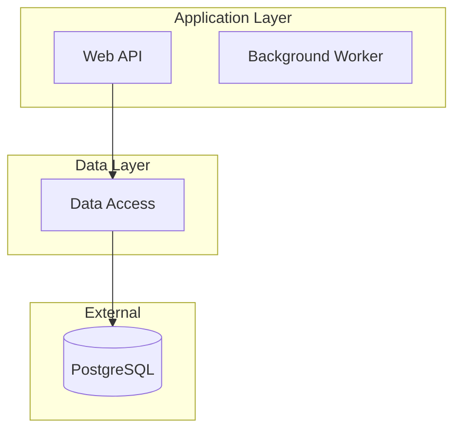

# Codebase Research Skill

## Purpose

A coordination skill that orchestrates research agents to comprehensively document codebases. The main agent coordinates and spawns research agents - it does NOT analyze code directly.

**Use Cases:** Onboarding, architecture discovery, dependency mapping, technical due diligence.

**Outputs:** Documentation only (no code changes) - process diagrams, data flow diagrams, component documentation, architecture narrative, dependency maps.

---

## Tool Usage Guide

### LSP Operations

Use LSP in Phase 2 (Connection Mapping) when available for the codebase language:

| Operation | Use Case |
|-----------|----------|
| `findReferences` | Find all usages of a service/repository class |
| `goToDefinition` | Trace dependency chains |
| `goToImplementation` | Find interface implementations |
| `incomingCalls` | Find what calls a function |
| `outgoingCalls` | Find what a function calls |

Fallback to Grep when LSP is unavailable or returns empty results.

### WebSearch

Use for unknown frameworks or patterns:
- `[framework] project structure conventions`
- `[framework] architecture patterns`
- `[framework] configuration file locations`

### Skill: mermaid-diagrams

For complex diagrams in Phase 4 (many nodes, custom styling), invoke:
```
Skill: mermaid-diagrams
```
Provides diagram generation, validation, and PNG export.

### Task Tools for Progress

Track progress with Task tools instead of state files:

```
TaskCreate: subject="Phase 1: Discovery", description="Map components and tech stacks"
TaskCreate: subject="Phase 2: Connections", description="Map dependencies"
TaskCreate: subject="Phase 3: Assessment", description="Evaluate complexity"
TaskCreate: subject="Phase 4: Synthesis", description="Generate final docs"
```

Update as you progress:
```
TaskUpdate: taskId=X, status="in_progress"
TaskUpdate: taskId=X, status="completed"
```

To resume interrupted research: `TaskList` shows pending phases.

---

## Execution Modes

Before starting, count discoverable components (solutions, projects, services, packages).

### Quick Component Count

Run Glob patterns to estimate:
```
*.sln, **/*.csproj       -> .NET
**/package.json          -> Node.js (exclude node_modules)
**/Cargo.toml            -> Rust
**/go.mod                -> Go
**/pom.xml, **/build.gradle -> Java
**/Dockerfile            -> Containerized services
```

### Mode Selection

| Components | Mode | Approach |
|------------|------|----------|
| <= 5 | Inline | Adopt specialist perspectives sequentially |
| 6-20 | Parallel | Spawn Explore agents |
| > 20 | Batched | Batch into groups of 10, process sequentially |

---

## Phase 1: Discovery

**Goal:** Map all components, tech stacks, and boundaries.

### Step 1.1: Initial Scan

Use Glob to find project markers. Count results, excluding `node_modules`, `bin`, `obj`, `target`, `dist`.

### Step 1.2: Component Discovery

**Inline Mode (<=5 components):**

Adopt each perspective sequentially:

1. **Project Analyst:** Examine folder structure, build files, solution organization. List all components with paths and types.

2. **Tech Archaeologist:** Identify frameworks, languages, versions from project files, lock files, config files.

3. **Entry Point Hunter:** Find bootstraps, hosts, deployment configs.

**Parallel Mode (>5 components):**

Spawn three Explore agents using prompts from Appendix A.

### Step 1.3: Merge and Write Inventory

1. Consolidate findings, deduplicate by path
2. Resolve conflicts (prefer wider boundary)
3. Create `docs/inventory.md` (mark as DRAFT)

---

## Phase 2: Connection Mapping

**Goal:** Map all dependencies - data, communication, and code.

### Step 2.1: Using LSP for Connections

When LSP is available:

1. **Find service consumers:**
   ```
   LSP: operation=findReferences, file=ServiceClass.cs, line=[class definition]
   ```

2. **Trace call chains:**
   ```
   LSP: operation=incomingCalls, file=Repository.cs, line=[method]
   ```

3. **Map interface implementations:**
   ```
   LSP: operation=goToImplementation, file=IService.cs, line=[interface]
   ```

### Step 2.2: Per-Component Analysis

**Inline Mode:**

For each component, adopt perspectives:

1. **Data Tracker:** Database connections, cache access, file I/O
2. **Wire Tracer:** HTTP clients, queues, events, gRPC
3. **Code Linker:** Project references, package dependencies

**Parallel Mode:**

Batch components (5-10 per batch). Spawn Connection Mapper agent using prompt from Appendix B.

### Step 2.3: Build Dependency Graph

Consolidate connections:
```yaml
ComponentA:
  depends_on: [ComponentB (ProjectRef), PostgreSQL (SQL)]
  depended_by: [ComponentD (HTTP)]
```

### Step 2.4: Create Component Documentation

For each component, create `docs/components/{component-name}.md` using template from Appendix D.

---

## Phase 3: Assessment

**Goal:** Evaluate component health and characteristics.

### Step 3.1: Complexity Scoring

| Factor | Low (1) | Medium (2) | High (3) |
|--------|---------|------------|----------|
| Dependencies | <=2 | 3-5 | 6+ |
| Coupling | Clear interfaces | Some shared state | Tight coupling |
| Tests | Has tests | Partial coverage | No tests |
| Documentation | Has docs | Minimal docs | No docs |

**Inline Mode:** Analyze each factor for each component.

**Parallel Mode:** Spawn Component Assessor agent using prompt from Appendix C.

### Step 3.2: Complexity Rating

| Total Score | Rating |
|-------------|--------|
| 4-5 | Low |
| 6-8 | Medium |
| 9-11 | High |
| 12 | Critical |

### Step 3.3: Update Documentation

Add assessment section to each component doc. Update `docs/inventory.md` with complexity column.

---

## Phase 4: Synthesis

**Goal:** Generate final documentation. Main agent only - no spawning.

### Step 4.1: System Diagram

Create system-wide Mermaid diagram. For complex diagrams (>15 nodes), use:
```
Skill: mermaid-diagrams
```

Example structure:


### Step 4.2: Create ARCHITECTURE.md

Write `docs/ARCHITECTURE.md` with: system diagram, component summary, data flow, communication patterns, tech stack summary.

### Step 4.3: Create COMPONENTS.md

Write `docs/COMPONENTS.md` with: quick reference table, components by type, dependency matrix.

### Step 4.4: Finalize

Update `docs/inventory.md`, remove DRAFT marker.

---

## Edge Cases

### Unknown Framework

When encountering unfamiliar frameworks:

1. Use WebSearch:
   - `[framework] project structure`
   - `[framework] architecture patterns`
   - `[framework] configuration files`

2. Adjust discovery patterns based on findings

### Monorepo

1. Identify workspace boundaries first
2. Create separate inventory per application
3. Note shared dependencies

### Large Codebase (>20 components)

Batch into groups of 10. Process sequentially. Merge findings between batches.

### Circular Dependencies

1. Flag in inventory with warning
2. Add to ARCHITECTURE.md as technical debt
3. Show in diagram with distinct notation (dashed red line)

---

## Output Verification

Before completing:

- [ ] `docs/inventory.md` - lists all components
- [ ] `docs/components/*.md` - one per component
- [ ] `docs/ARCHITECTURE.md` - system diagram included
- [ ] `docs/COMPONENTS.md` - summary and matrix
- [ ] Mermaid diagrams render (valid syntax)
- [ ] No placeholder text remains
- [ ] Complexity ratings assigned

---

## Appendix A: Discovery Agent Prompts

### Project Analyst

```
subagent_type: Explore
description: "Project Analyst - structure discovery"
prompt: |
  You are a Project Analyst examining codebase structure.

  TASK: Find all components, solutions, projects, and their organization.

  SEARCH FOR:
  - Solution files (*.sln) and their project references
  - Project files (*.csproj, package.json, Cargo.toml, go.mod, pom.xml)
  - Folder structure and naming conventions
  - Shared/common libraries vs application projects
  - Test projects and their targets

  OUTPUT FORMAT (YAML):
  specialist: Project Analyst
  findings:
    - component: [name]
      path: [relative path]
      type: [solution|project|service|library|test]
      subcomponents: [list if applicable]
      evidence: [files that indicate this]
```

### Tech Archaeologist

```
subagent_type: Explore
description: "Tech Archaeologist - stack discovery"
prompt: |
  You are a Tech Archaeologist identifying technology stacks.

  TASK: Identify all frameworks, languages, and versions.

  SEARCH FOR:
  - Language versions (TargetFramework, python version, node version)
  - Framework dependencies (ASP.NET, Express, Django, Spring)
  - Major packages and versions
  - Build tools and configuration patterns

  OUTPUT FORMAT (YAML):
  specialist: Tech Archaeologist
  findings:
    - component: [name]
      languages: [list]
      frameworks: [list with versions]
      key_dependencies: [major packages]
      build_tool: [tool name]
```

### Entry Point Hunter

```
subagent_type: Explore
description: "Entry Point Hunter - boundary discovery"
prompt: |
  You are an Entry Point Hunter finding application boundaries.

  TASK: Find all entry points, hosts, and deployment configurations.

  SEARCH FOR:
  - Main entry points (Program.cs, main.py, index.js, Main.java)
  - Host builders (WebApplication, HostBuilder, createServer)
  - Deployment configs (Dockerfile, docker-compose, kubernetes)
  - API definitions (OpenAPI, swagger, GraphQL schemas)

  OUTPUT FORMAT (YAML):
  specialist: Entry Point Hunter
  findings:
    - component: [name]
      entry_point: [file path]
      host_type: [web|worker|console|function]
      deployment: [docker|k8s|azure|aws|none]
      exposed_interfaces: [http|grpc|queue|none]
```

---

## Appendix B: Connection Mapper Prompt

```
subagent_type: Explore
description: "Connection Mapper - [batch description]"
prompt: |
  You are a Connection Mapper analyzing dependencies.

  COMPONENTS TO ANALYZE: [list component names and paths]

  FOR EACH COMPONENT, FIND:

  1. DATA CONNECTIONS:
     - Database connections (connection strings, DbContext, repositories)
     - Cache access (Redis, Memcached, in-memory)
     - File system and external storage (S3, Blob)

  2. COMMUNICATION:
     - HTTP client calls (HttpClient, RestSharp, fetch)
     - Queue/messaging (RabbitMQ, Kafka, Azure Service Bus)
     - gRPC, WebSocket/SignalR, event handlers

  3. CODE DEPENDENCIES:
     - Project references
     - Package dependencies
     - Interface implementations from other projects

  OUTPUT FORMAT (YAML):
  specialist: Connection Mapper
  component: [name]
  connections:
    data:
      - target: [name]
        type: [SQL|NoSQL|Cache|File|Blob]
        access_pattern: [read|write|readwrite]
    communication:
      - target: [service or URL]
        type: [HTTP|Queue|gRPC|WebSocket|Event]
        direction: [inbound|outbound|bidirectional]
    code:
      - target: [project/package]
        type: [ProjectRef|PackageRef|Import]
```

---

## Appendix C: Component Assessor Prompt

```
subagent_type: Explore
description: "Assessor - [component batch]"
prompt: |
  You are a Component Assessor evaluating complexity.

  COMPONENTS TO ASSESS: [list]

  FOR EACH COMPONENT, EVALUATE:
  1. DEPENDENCY COUNT: Count unique dependencies (code refs + external)
  2. COUPLING: Check for shared state, circular refs, god classes
  3. TEST COVERAGE: Look for test projects/files targeting component
  4. DOCUMENTATION: Check for README, XML docs, comments

  OUTPUT FORMAT (YAML):
  specialist: Assessor
  component: [name]
  assessment:
    dependency_count: [number]
    coupling_rating: [low|medium|high]
    coupling_evidence: [why]
    has_tests: [yes|partial|no]
    documentation: [good|minimal|none]
    complexity_score: [4-12]
    complexity_rating: [Low|Medium|High|Critical]
  notes: [concerns or observations]
```

---

## Appendix D: Component Doc Template

```markdown
# {Component Name}

## Overview
[Brief description based on discovery findings]

## Tech Stack
- Language: [language and version]
- Framework: [framework and version]
- Key Dependencies: [list]

## Entry Point
- File: [path]
- Type: [web|worker|console|function]

## Connections

### Data
| Target | Type | Access Pattern |
|--------|------|----------------|

### Communication
| Target | Type | Direction |
|--------|------|-----------|

### Code Dependencies
| Target | Type |
|--------|------|

## Dependency Diagram
[Mermaid diagram showing this component's connections]

## Assessment
| Factor | Rating | Evidence |
|--------|--------|----------|
| Dependencies | [count] | [list] |
| Coupling | [rating] | [evidence] |
| Tests | [status] | [evidence] |
| Documentation | [status] | [evidence] |

**Complexity Rating:** [Low|Medium|High|Critical]
```
