# Mermaid Diagram Patterns

Templates and patterns for generating consistent diagrams in codebase documentation.

---

## System Architecture Diagrams

### Basic System Diagram

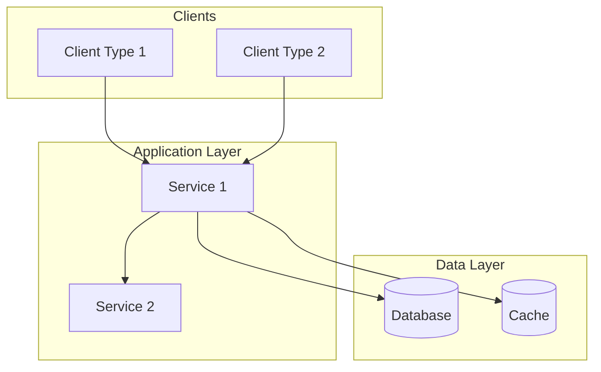

### Layered Architecture

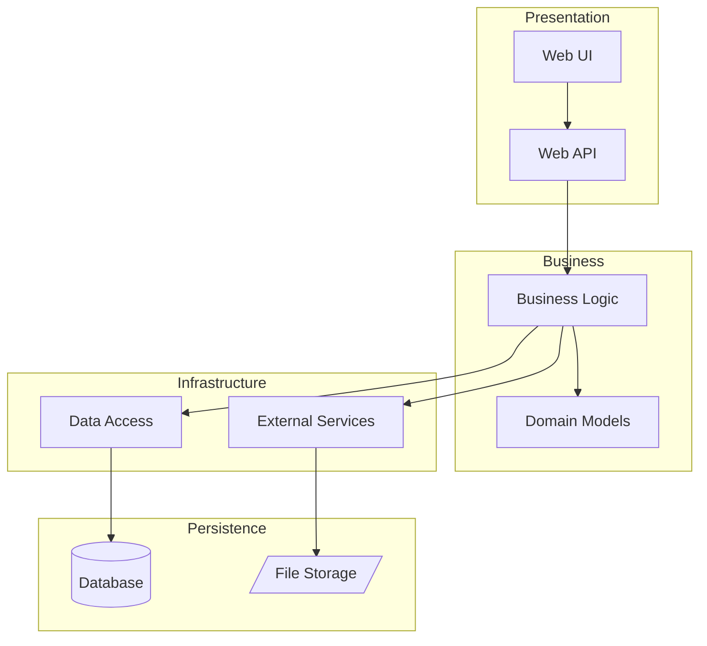

### Microservices Architecture

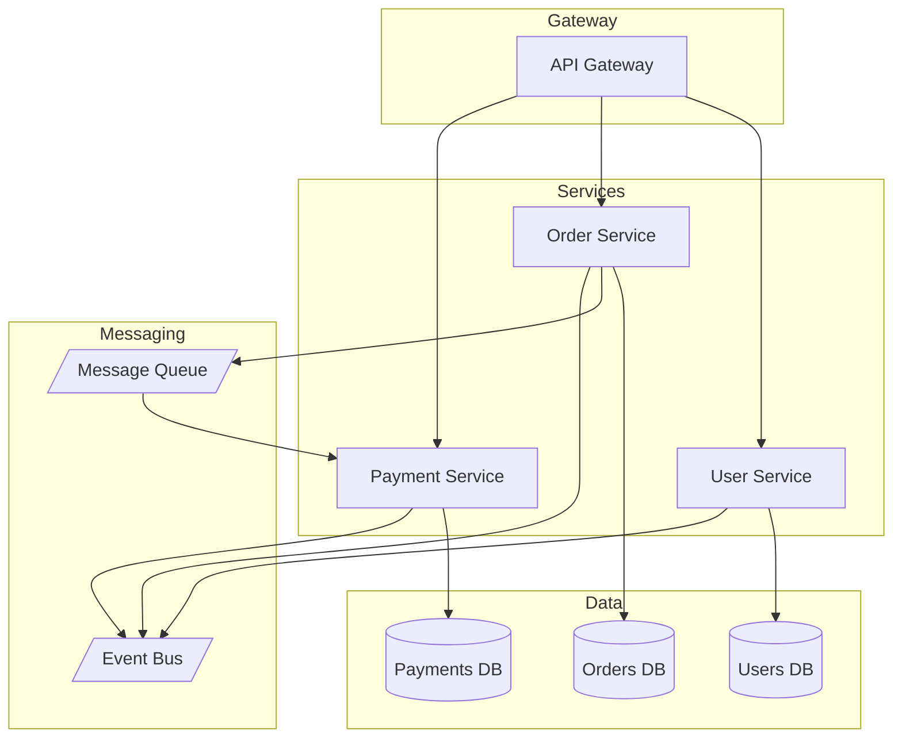

---

## Component Diagrams

### Single Component Dependencies

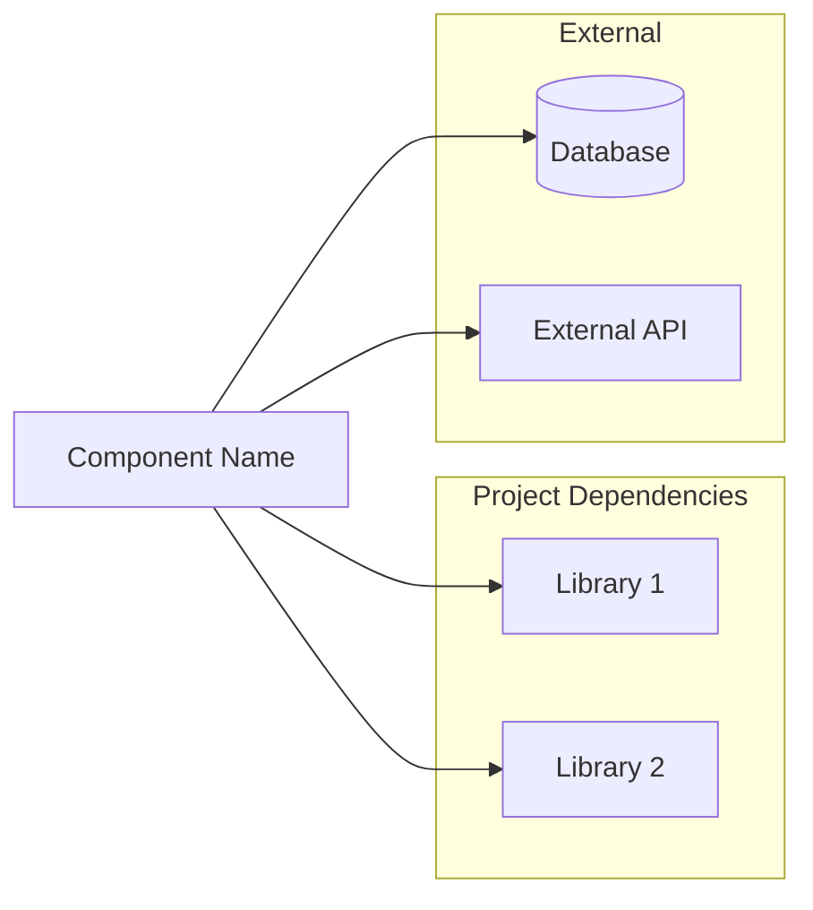

### Component with Bidirectional Connections

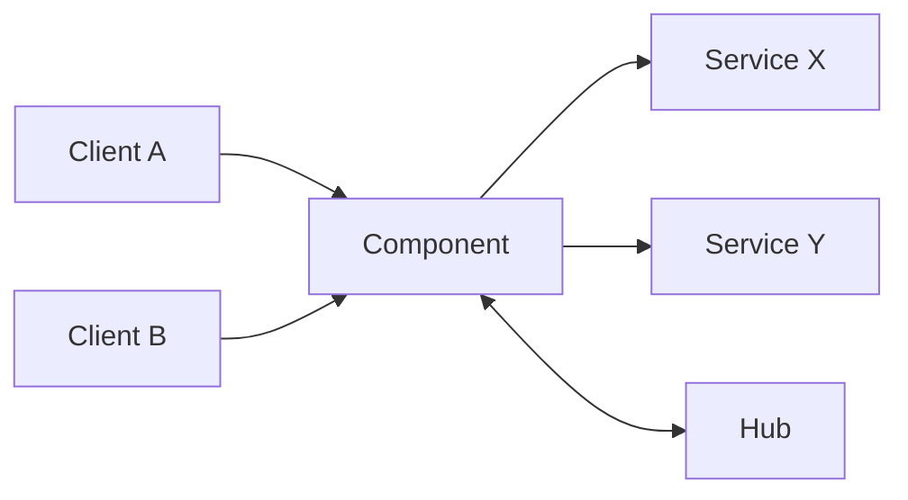

### Component Internal Structure

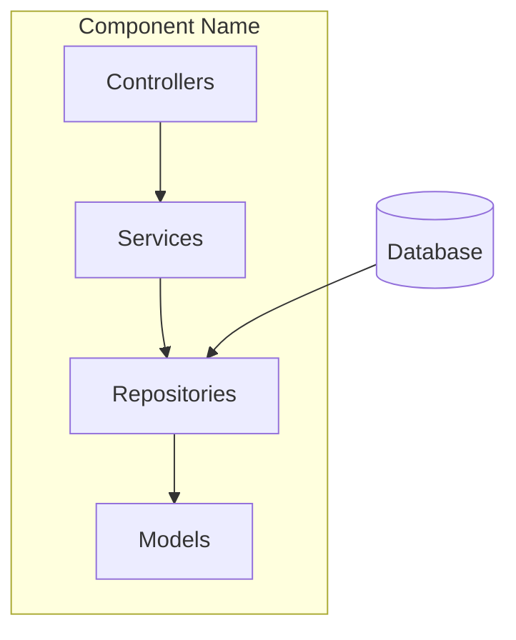

---

## Data Flow Diagrams

### Request-Response Flow

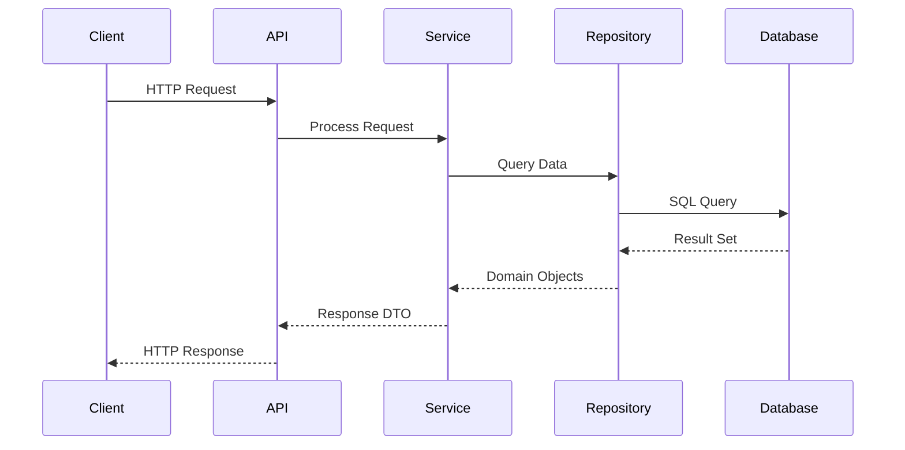

### Async Processing Flow

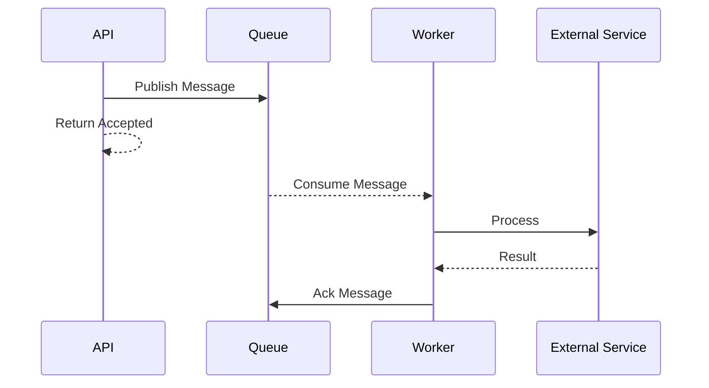

### Event-Driven Flow

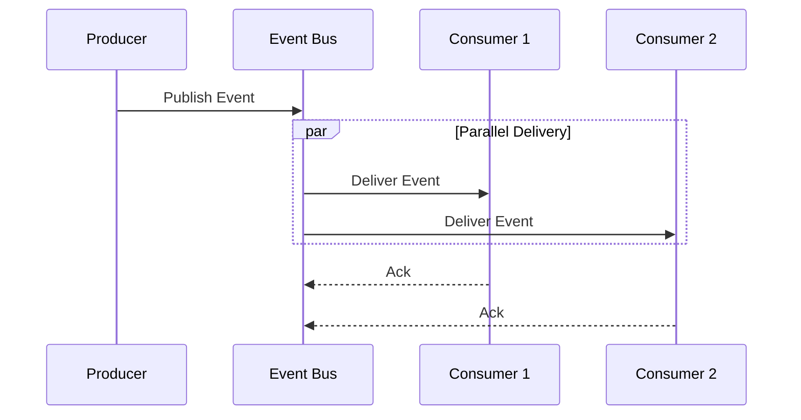

---

## Dependency Graphs

### Simple Dependency Graph

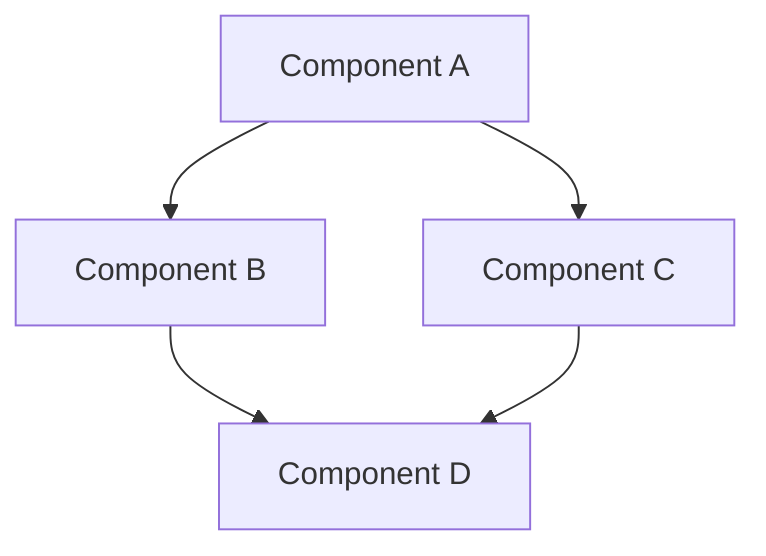

### Dependency Graph with Layers

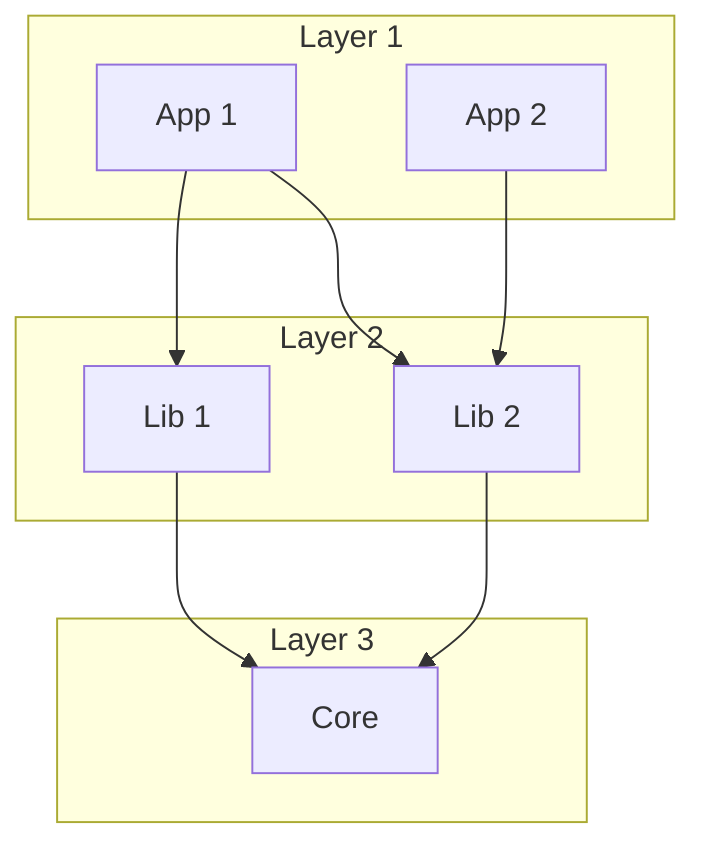

### Circular Dependency Warning

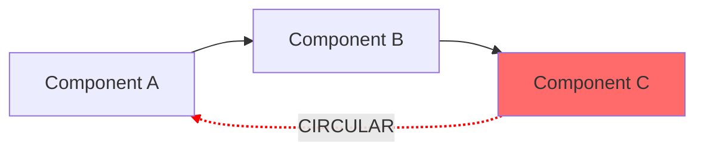

---

## Node Shapes Reference

Use consistent shapes for different entity types:

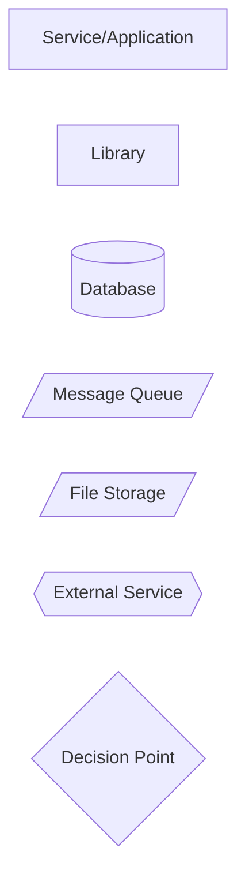

### Shape Usage Guide

| Entity Type | Shape | Syntax |
|-------------|-------|--------|
| Service/App | Rectangle | `[Name]` |
| Library | Rectangle | `[Name]` |
| Database | Cylinder | `[(Name)]` |
| Queue/Topic | Parallelogram | `[/Name/]` |
| File Storage | Parallelogram | `[/Name/]` |
| External API | Hexagon | `{{Name}}` |
| Decision | Diamond | `{Name}` |
| Subgraph | Group box | `subgraph "Name"` |

---

## Styling Patterns

### Highlight Critical Components

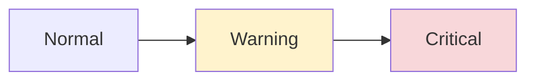

### Connection Types

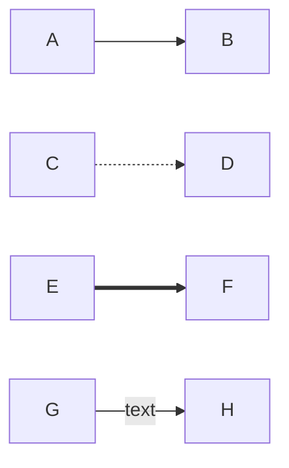

---

## Complete Examples

### E-Commerce System

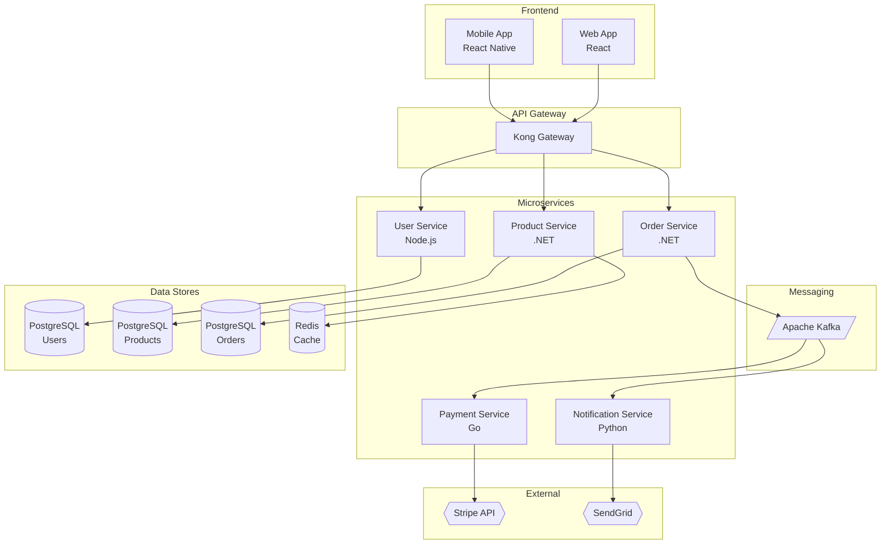

### .NET Solution Structure

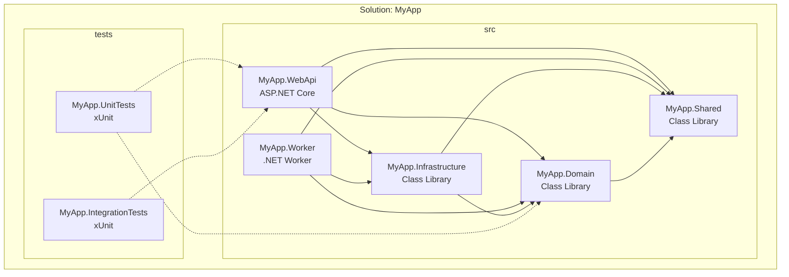

### Data Pipeline

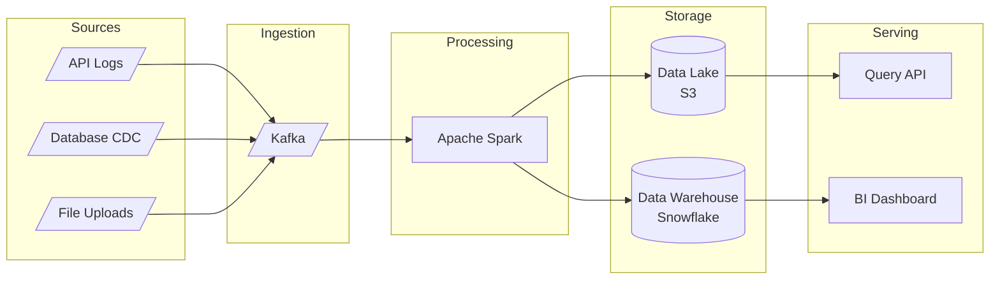

---

## Diagram Generation Checklist

When creating diagrams:

1. **Identify all components** from discovery phase
2. **Choose appropriate layout**
   - TB (top-bottom) for hierarchical systems
   - LR (left-right) for flow-based systems
3. **Group related components** using subgraphs
4. **Use consistent shapes** per entity type
5. **Label connections** when relationship isn't obvious
6. **Highlight** warnings or problems
7. **Keep it readable** - split complex diagrams
8. **Validate syntax** before including in documentation
