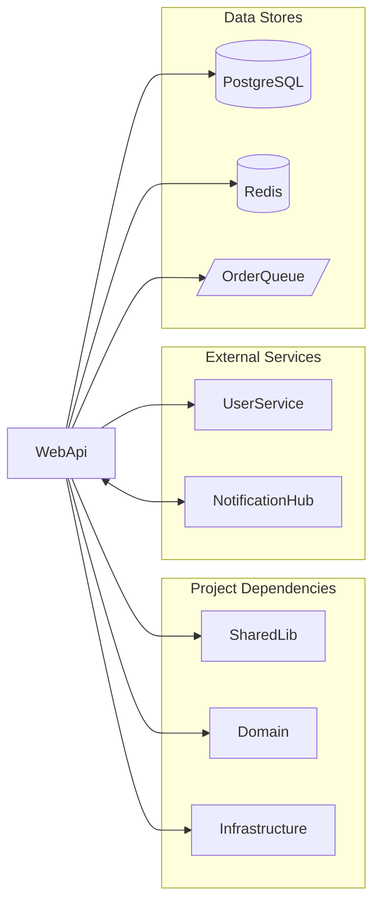
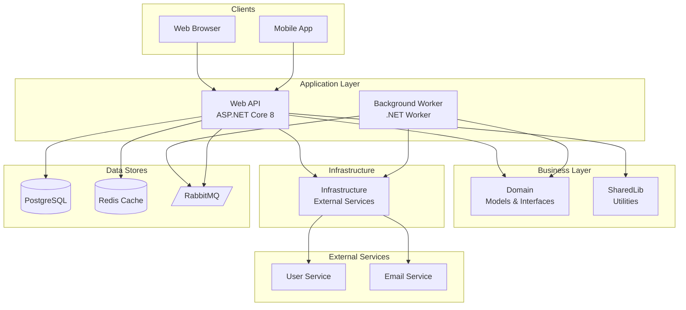
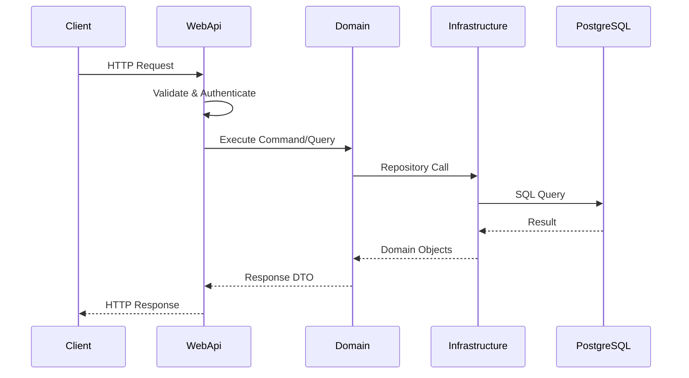
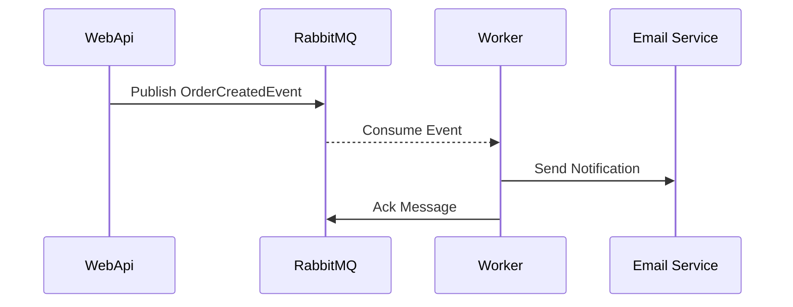
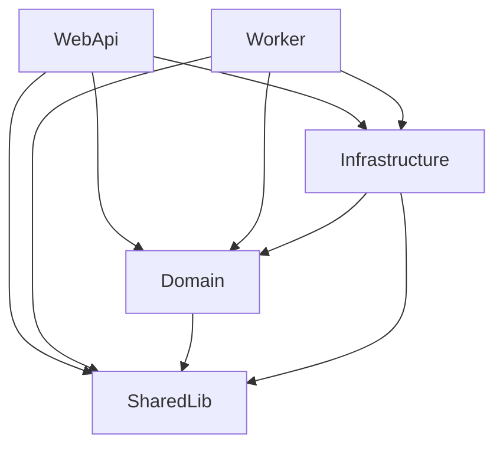

# Output Templates

This document provides exact templates for all documentation outputs. Agents and the main coordinator MUST follow these formats exactly.

---

## Agent Return Formats

### Project Analyst Return Format

```yaml
specialist: Project Analyst
timestamp: 2024-01-15T10:30:00Z
findings:
  - component: WebApi
    path: src/WebApi
    type: service
    subcomponents:
      - Controllers
      - Middleware
    evidence:
      - WebApi.csproj
      - Program.cs
      - appsettings.json
  - component: SharedLib
    path: src/SharedLib
    type: library
    subcomponents: []
    evidence:
      - SharedLib.csproj
  - component: WebApi.Tests
    path: tests/WebApi.Tests
    type: test
    subcomponents: []
    evidence:
      - WebApi.Tests.csproj
      - references WebApi project
```

### Tech Archaeologist Return Format

```yaml
specialist: Tech Archaeologist
timestamp: 2024-01-15T10:32:00Z
findings:
  - component: WebApi
    languages:
      - C# 12
    frameworks:
      - ASP.NET Core 8.0
      - Entity Framework Core 8.0.1
    key_dependencies:
      - Serilog 3.1.1
      - MediatR 12.2.0
      - FluentValidation 11.9.0
    build_tool: dotnet SDK 8.0
    target_framework: net8.0
  - component: SharedLib
    languages:
      - C# 12
    frameworks:
      - .NET 8.0 (class library)
    key_dependencies:
      - Newtonsoft.Json 13.0.3
    build_tool: dotnet SDK 8.0
    target_framework: net8.0
```

### Entry Point Hunter Return Format

```yaml
specialist: Entry Point Hunter
timestamp: 2024-01-15T10:35:00Z
findings:
  - component: WebApi
    entry_point: src/WebApi/Program.cs
    host_type: web
    startup_pattern: minimal API with WebApplication.CreateBuilder
    deployment:
      - Dockerfile present
      - docker-compose.yml reference
    exposed_interfaces:
      - HTTP REST API on port 5000
      - Swagger/OpenAPI at /swagger
    environment_config:
      - appsettings.json
      - appsettings.Development.json
  - component: BackgroundWorker
    entry_point: src/Worker/Program.cs
    host_type: worker
    startup_pattern: HostBuilder with IHostedService
    deployment:
      - Dockerfile present
    exposed_interfaces:
      - None (consumes from RabbitMQ)
```

### Connection Mapper Return Format

```yaml
specialist: Connection Mapper
timestamp: 2024-01-15T10:40:00Z
component: WebApi
connections:
  data:
    - target: PostgreSQL
      type: SQL
      evidence:
        - Npgsql.EntityFrameworkCore.PostgreSQL package
        - ConnectionStrings:DefaultConnection in appsettings
        - ApplicationDbContext in Data folder
      access_pattern: readwrite
    - target: Redis
      type: Cache
      evidence:
        - StackExchange.Redis package
        - ICacheService in DI registration
      access_pattern: readwrite
  communication:
    - target: UserService
      type: HTTP
      evidence:
        - IUserServiceClient interface
        - HttpClient registration for userservice-api
      direction: outbound
    - target: OrderQueue
      type: Queue
      evidence:
        - MassTransit package
        - IPublishEndpoint injection
        - OrderCreatedEvent class
      direction: outbound
  code:
    - target: SharedLib
      type: ProjectRef
      evidence: WebApi.csproj ProjectReference
    - target: Domain
      type: ProjectRef
      evidence: WebApi.csproj ProjectReference
    - target: MediatR
      type: PackageRef
      evidence: WebApi.csproj PackageReference
```

### Component Assessor Return Format

```yaml
specialist: Assessor
timestamp: 2024-01-15T10:45:00Z
component: WebApi
assessment:
  dependency_count: 8
  coupling_rating: medium
  coupling_evidence:
    - Direct reference to Domain project
    - Some service classes have 5+ constructor dependencies
    - Clean controller/service separation
  has_tests: partial
  test_evidence:
    - WebApi.Tests project exists
    - 45 test files covering controllers
    - Missing integration tests for middleware
  documentation: minimal
  documentation_evidence:
    - XML comments on public APIs
    - No README in project folder
    - Swagger annotations present
  size_estimate: medium
  size_evidence:
    - 12 controllers
    - 8 services
    - ~3500 LOC estimated
  complexity_score: 9
  complexity_rating: Medium
notes:
  - Consider breaking UserController into smaller units
  - Redis caching logic duplicated in 3 services
```

---

## Document Templates

### docs/inventory.md

```markdown
# Component Inventory

> Generated by codebase-research skill on [DATE]

## Summary

- **Total Components:** [N]
- **Services:** [N]
- **Libraries:** [N]
- **Test Projects:** [N]

## Components

| Component | Path | Type | Tech Stack | Entry Point | Complexity |
|-----------|------|------|------------|-------------|------------|
| WebApi | src/WebApi | service | ASP.NET Core 8, EF Core | Program.cs | Medium |
| SharedLib | src/SharedLib | library | .NET 8 | - | Low |
| Domain | src/Domain | library | .NET 8 | - | Low |
| Worker | src/Worker | service | .NET 8 Worker | Program.cs | Low |
| WebApi.Tests | tests/WebApi.Tests | test | xUnit | - | - |

## Legend

| Type | Description |
|------|-------------|
| service | Deployable application (web, worker, console) |
| library | Shared code library |
| test | Test project |

| Complexity | Criteria |
|------------|----------|
| Low | <=2 deps, clear boundaries, has tests |
| Medium | 3-5 deps, some coupling |
| High | 6+ deps, tight coupling |
| Critical | Hub component, legacy, no tests |
```

### docs/components/{component-name}.md

```markdown
# WebApi

> API service providing RESTful endpoints for the application.

## Overview

The WebApi project is the main HTTP entry point for the system. It handles authentication, request validation, and orchestrates business operations through MediatR commands and queries.

## Tech Stack

| Category | Technology |
|----------|------------|
| Language | C# 12 |
| Framework | ASP.NET Core 8.0 |
| ORM | Entity Framework Core 8.0.1 |
| Validation | FluentValidation 11.9.0 |
| Mediator | MediatR 12.2.0 |
| Logging | Serilog 3.1.1 |

## Entry Point

| Property | Value |
|----------|-------|
| File | src/WebApi/Program.cs |
| Type | web |
| Pattern | Minimal API with WebApplication.CreateBuilder |
| Port | 5000 (HTTP), 5001 (HTTPS) |

## Deployment

- **Dockerfile:** Present at src/WebApi/Dockerfile
- **Compose:** Referenced in docker-compose.yml
- **Environment:** appsettings.json, appsettings.{Environment}.json

## Connections

### Data

| Target | Type | Access Pattern | Evidence |
|--------|------|----------------|----------|
| PostgreSQL | SQL | Read/Write | ApplicationDbContext, Npgsql package |
| Redis | Cache | Read/Write | StackExchange.Redis, ICacheService |

### Communication

| Target | Type | Direction | Evidence |
|--------|------|-----------|----------|
| UserService | HTTP | Outbound | IUserServiceClient, HttpClient config |
| OrderQueue | Queue | Outbound | MassTransit, OrderCreatedEvent |
| NotificationHub | WebSocket | Bidirectional | SignalR hub |

### Code Dependencies

| Target | Type | Purpose |
|--------|------|---------|
| SharedLib | ProjectRef | Common utilities and extensions |
| Domain | ProjectRef | Domain models and interfaces |
| Infrastructure | ProjectRef | External service implementations |

## Dependency Diagram



## Assessment

| Factor | Rating | Evidence |
|--------|--------|----------|
| Dependencies | 8 | 3 project refs, 5 major packages |
| Coupling | Medium | Clean separation, some large services |
| Tests | Partial | Controller tests exist, missing integration |
| Documentation | Minimal | XML docs, Swagger, no README |
| Size | Medium | 12 controllers, 8 services, ~3500 LOC |

**Complexity Rating:** Medium (Score: 9/15)

### Observations

- UserController is a candidate for splitting (15 endpoints)
- Redis caching logic appears in 3 services - consider extracting
- Good use of MediatR for CQRS pattern
- Missing health check endpoints
```

### docs/ARCHITECTURE.md

```markdown
# Architecture Overview

> Generated by codebase-research skill on [DATE]

## System Diagram



## Component Summary

| Component | Type | Purpose | Complexity |
|-----------|------|---------|------------|
| WebApi | Service | REST API for clients | Medium |
| Worker | Service | Background job processing | Low |
| Domain | Library | Domain models and business interfaces | Low |
| SharedLib | Library | Common utilities and extensions | Low |
| Infrastructure | Library | External service implementations | Medium |

## Layered Architecture

This codebase follows a layered architecture pattern:

1. **Presentation Layer** (WebApi)
   - HTTP request handling
   - Authentication/Authorization
   - Request validation
   - Response formatting

2. **Business Layer** (Domain)
   - Domain models (entities, value objects)
   - Business interfaces (repositories, services)
   - Domain events

3. **Infrastructure Layer** (Infrastructure)
   - Database access (EF Core)
   - External service clients
   - Caching implementation

4. **Cross-Cutting** (SharedLib)
   - Extension methods
   - Common utilities
   - Shared constants

## Data Flow

### Request Flow



### Event Flow



## Communication Patterns

| Pattern | Usage | Components |
|---------|-------|------------|
| REST | Client-to-API | Browser, Mobile -> WebApi |
| Message Queue | Async processing | WebApi -> RabbitMQ -> Worker |
| HTTP Client | Service-to-service | WebApi -> UserService |
| SignalR | Real-time updates | WebApi <-> Browser |

## Key Architectural Decisions

1. **CQRS with MediatR**
   - Commands and queries separated via MediatR handlers
   - Enables clean separation of read/write operations

2. **Repository Pattern**
   - Domain defines interfaces, Infrastructure implements
   - Allows database technology swap

3. **Event-Driven Processing**
   - Long-running operations published to queue
   - Worker service processes asynchronously

4. **Configuration-Based Clients**
   - External service URLs in configuration
   - HttpClientFactory with named clients

## Technology Stack Summary

| Category | Technology | Version |
|----------|------------|---------|
| Language | C# | 12 |
| Runtime | .NET | 8.0 |
| Web Framework | ASP.NET Core | 8.0 |
| ORM | Entity Framework Core | 8.0.1 |
| Database | PostgreSQL | 15 |
| Cache | Redis | 7 |
| Message Queue | RabbitMQ | 3.12 |
| Container | Docker | - |

## Technical Debt & Observations

| Item | Severity | Component | Notes |
|------|----------|-----------|-------|
| Large controller | Medium | WebApi | UserController has 15 endpoints |
| Duplicated caching | Low | WebApi | Same pattern in 3 services |
| Missing health checks | Low | WebApi, Worker | No /health endpoints |
| Integration test gaps | Medium | WebApi.Tests | Only unit tests exist |
```

### docs/COMPONENTS.md

```markdown
# Components Overview

> Quick reference for all system components

## Quick Reference

| Component | Type | Complexity | Key Dependencies | Entry Point |
|-----------|------|------------|------------------|-------------|
| WebApi | service | Medium | Domain, SharedLib, EF Core | Program.cs |
| Worker | service | Low | Domain, MassTransit | Program.cs |
| Domain | library | Low | - | - |
| SharedLib | library | Low | - | - |
| Infrastructure | library | Medium | Domain, Npgsql | - |

## By Type

### Services

#### WebApi
REST API service providing client-facing endpoints. Handles authentication, validation, and request orchestration.
- **Tech:** ASP.NET Core 8, MediatR, FluentValidation
- **Deploys:** Docker container, port 5000

#### Worker
Background processing service for async operations.
- **Tech:** .NET Worker Service, MassTransit
- **Deploys:** Docker container

### Libraries

#### Domain
Core domain models, entities, and business interfaces.
- **Tech:** .NET 8 class library
- **Contains:** Entities, Value Objects, Repository Interfaces, Domain Events

#### SharedLib
Cross-cutting utilities and extensions.
- **Tech:** .NET 8 class library
- **Contains:** Extension methods, Constants, Common DTOs

#### Infrastructure
External service implementations and data access.
- **Tech:** .NET 8, EF Core, HttpClient
- **Contains:** DbContext, Repositories, Service Clients

### Test Projects

#### WebApi.Tests
Unit and integration tests for WebApi.
- **Tech:** xUnit, NSubstitute, FluentAssertions
- **Coverage:** Controllers (good), Services (partial)

## Dependency Matrix

Shows which components depend on which. Read as "row depends on column".

|               | WebApi | Worker | Domain | SharedLib | Infrastructure |
|---------------|--------|--------|--------|-----------|----------------|
| WebApi        | -      | -      | X      | X         | X              |
| Worker        | -      | -      | X      | X         | X              |
| Domain        | -      | -      | -      | X         | -              |
| SharedLib     | -      | -      | -      | -         | -              |
| Infrastructure| -      | -      | X      | X         | -              |

## Dependency Graph



## External Dependencies

| Component | External Service | Protocol | Purpose |
|-----------|-----------------|----------|---------|
| WebApi | PostgreSQL | TCP/SQL | Primary data store |
| WebApi | Redis | TCP | Caching |
| WebApi | UserService | HTTP | User data |
| Worker | RabbitMQ | AMQP | Job queue |
| Worker | Email Service | HTTP | Notifications |
```

---

## State File Template

### docs/.research-state.yaml

```yaml
# Codebase Research State File
# Used for resuming interrupted research sessions

version: 1
started: 2024-01-15T10:00:00Z
last_updated: 2024-01-15T10:45:00Z

phase: 2
step: 2.1
status: in_progress

components_discovered:
  - name: WebApi
    path: src/WebApi
    type: service
    analyzed: true
  - name: Worker
    path: src/Worker
    type: service
    analyzed: true
  - name: Domain
    path: src/Domain
    type: library
    analyzed: false
  - name: SharedLib
    path: src/SharedLib
    type: library
    analyzed: false

pending_analysis:
  - Domain
  - SharedLib

documents_created:
  - docs/inventory.md
  - docs/components/WebApi.md
  - docs/components/Worker.md

notes:
  - Large codebase, using parallel mode
  - Batched into 2 groups of 3 components each
```

---

## Validation Checklist

Before finalizing documentation, verify:

```markdown
## Pre-Completion Checklist

### Files Created
- [ ] docs/inventory.md
- [ ] docs/ARCHITECTURE.md
- [ ] docs/COMPONENTS.md
- [ ] docs/components/{each-component}.md

### Content Validation
- [ ] All components from discovery are in inventory
- [ ] Each component has a dedicated doc file
- [ ] All Mermaid diagrams use valid syntax
- [ ] No [PLACEHOLDER] text remains
- [ ] Complexity ratings assigned to all components
- [ ] Tech stack versions are specific (not "latest")

### Diagram Validation
- [ ] System diagram shows all components
- [ ] Component diagrams show connections
- [ ] Arrow directions are correct (dependency flows)
- [ ] External services use appropriate shapes

### Cross-Reference
- [ ] Inventory matches COMPONENTS.md
- [ ] Dependency matrix is consistent
- [ ] All connections mentioned in component docs appear in ARCHITECTURE.md
```
