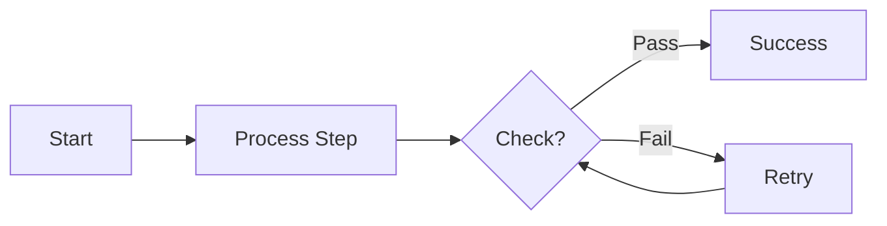
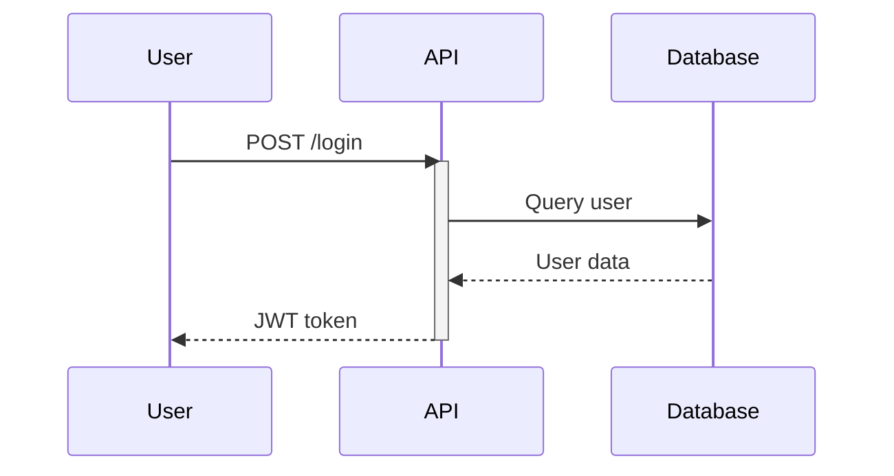
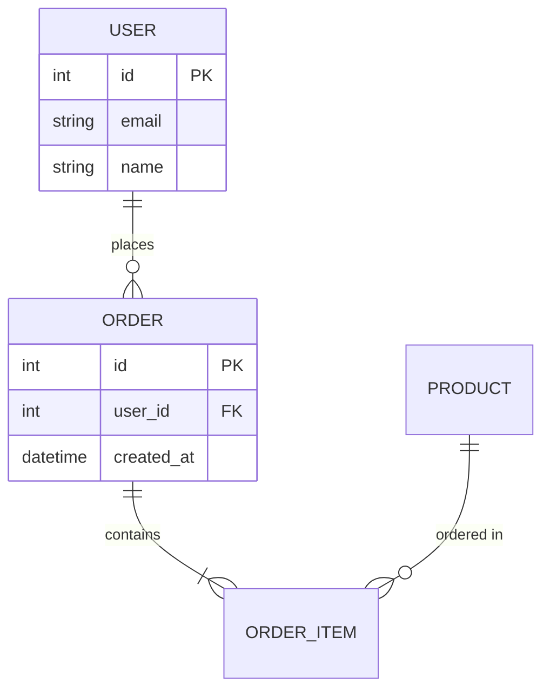
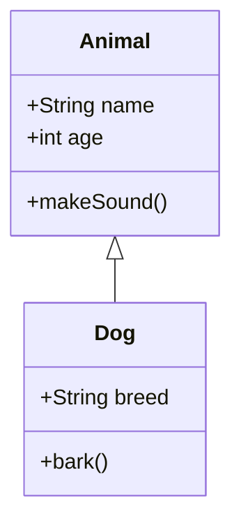
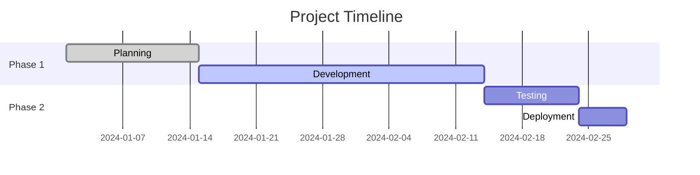

# Mermaid Diagrams Skill

Generate professional diagrams from Mermaid markup language using `@mermaid-js/mermaid-cli`.

## When to Use This Skill

Use this skill when the user requests:
- Flowcharts or process diagrams
- Sequence diagrams (API flows, user interactions)
- Entity-relationship diagrams (database schemas)
- Class diagrams (object-oriented design)
- State diagrams (state machines, workflows)
- C4 architecture diagrams (context, container, component)
- Gantt charts (project timelines)
- Git graphs (branch visualization)
- Mindmaps, pie charts, user journeys, timelines

## Quick Start

```bash
# Create .mmd file with mermaid syntax, then:
npx -y @mermaid-js/mermaid-cli -i diagram.mmd -o diagram.svg
```

**Output formats** (by extension): `.svg` (preferred), `.png`, `.pdf`

## Common Diagram Types

### Flowchart



**Generate:**
```bash
npx -y @mermaid-js/mermaid-cli -i flowchart.mmd -o flowchart.svg
```

### Sequence Diagram



**Generate:**
```bash
npx -y @mermaid-js/mermaid-cli -i sequence.mmd -o sequence.svg
```

### Entity-Relationship Diagram



**Generate:**
```bash
npx -y @mermaid-js/mermaid-cli -i erd.mmd -o erd.svg
```

### Class Diagram



**Generate:**
```bash
npx -y @mermaid-js/mermaid-cli -i classes.mmd -o classes.svg
```

### Gantt Chart



**Generate:**
```bash
npx -y @mermaid-js/mermaid-cli -i gantt.mmd -o gantt.svg
```

## Common Options

```bash
# Theme: default, forest, dark, neutral
npx -y @mermaid-js/mermaid-cli -i diagram.mmd -o out.svg -t dark

# Background (transparent for embedding)
npx -y @mermaid-js/mermaid-cli -i diagram.mmd -o out.svg -b transparent

# Size and scale (for PNG/PDF)
npx -y @mermaid-js/mermaid-cli -i diagram.mmd -o out.png -w 1920 -s 2

# Config file for custom theming
npx -y @mermaid-js/mermaid-cli -i diagram.mmd -o out.svg -c mermaid-config.json
```

See `@references/cli_options.md` for full options and config file examples.

## Batch Processing (PowerShell)

```powershell
Get-ChildItem *.mmd | ForEach-Object {
    npx -y @mermaid-js/mermaid-cli -i $_.Name -o "$($_.BaseName).svg"
}
```

## References

- `@references/diagram_examples.md` - Comprehensive syntax for all diagram types
- `@references/cli_options.md` - Full CLI options and config examples
- [mermaid.live](https://mermaid.live/) - Online editor for testing
- [mermaid.js.org](https://mermaid.js.org/) - Official documentation

## Workflow

1. Create `.mmd` file with Mermaid syntax (see `@references/diagram_examples.md`)
2. Generate: `npx -y @mermaid-js/mermaid-cli -i file.mmd -o file.svg`
3. For complex diagrams, break into smaller sub-diagrams
