# Mermaid Diagram Examples

Comprehensive examples of common Mermaid diagram types with syntax.

## Flowchart

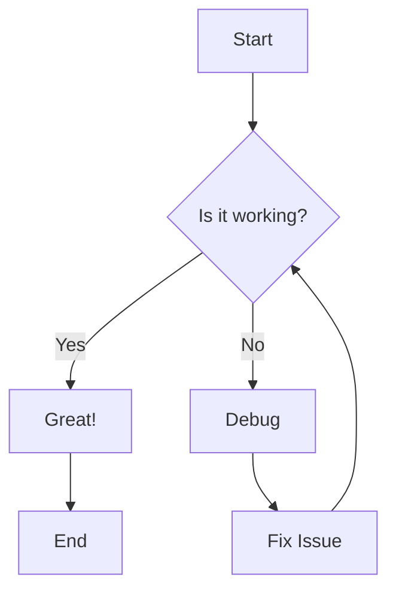

**Common Shapes:**
- `[Rectangle]` - Process
- `{Diamond}` - Decision
- `([Stadium])` - Start/End
- `[[Subroutine]]` - Subroutine
- `[(Database)]` - Database
- `((Circle))` - Circle

**Directions:** `TD` (top-down), `LR` (left-right), `BT` (bottom-top), `RL` (right-left)

## Sequence Diagram

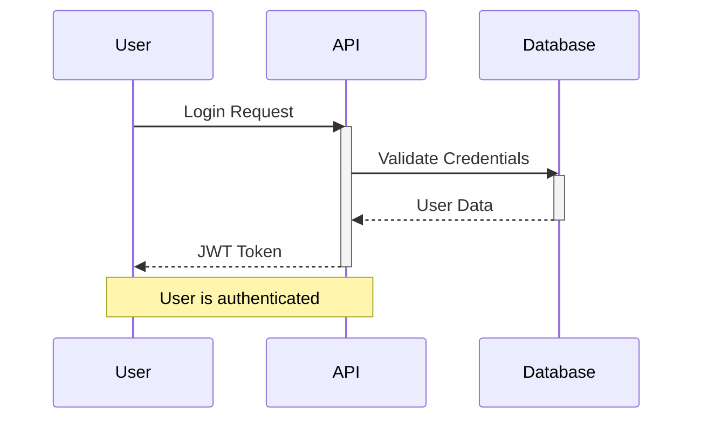

**Arrow Types:**
- `->` - Solid line without arrow
- `-->` - Dotted line without arrow
- `->>` - Solid line with arrow
- `-->>` - Dotted line with arrow
- `-x` - Solid line with cross
- `--x` - Dotted line with cross

## Class Diagram

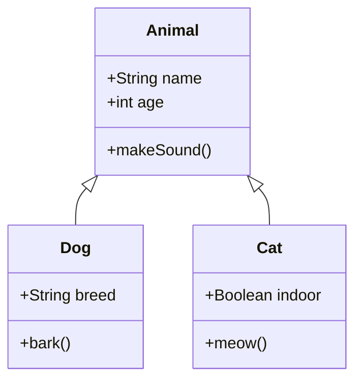

**Relationships:**
- `<|--` - Inheritance
- `*--` - Composition
- `o--` - Aggregation
- `-->` - Association
- `--` - Link (solid)
- `..|>` - Realization
- `..>` - Dependency

## State Diagram

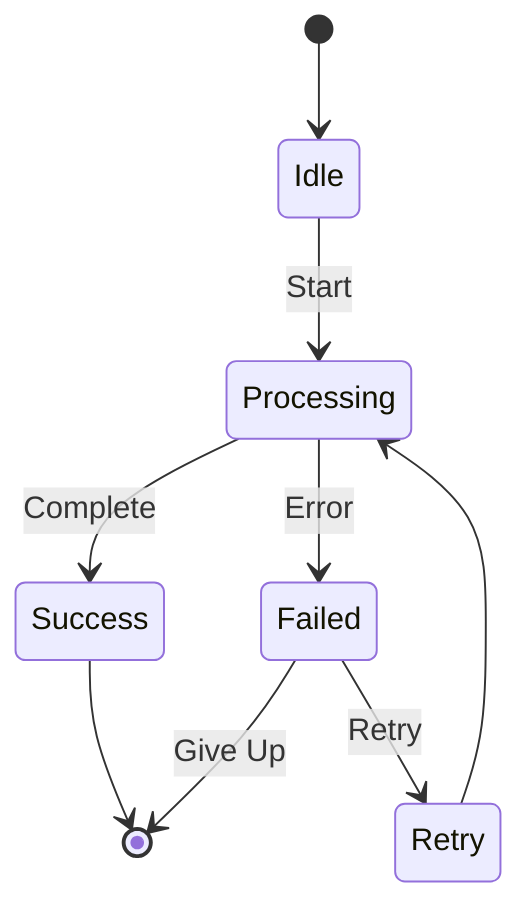

## Entity Relationship Diagram (ERD)

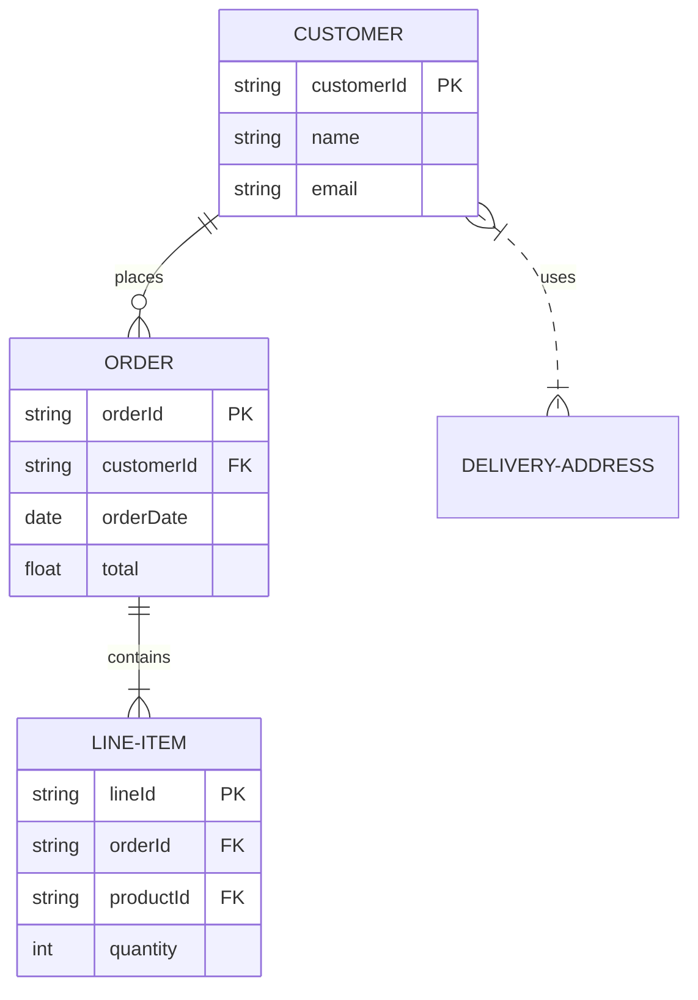

**Cardinality:**
- `||--||` - One to one
- `||--o{` - One to many
- `}o--o{` - Many to many
- `||..|{` - One to many (dotted)

## Gantt Chart

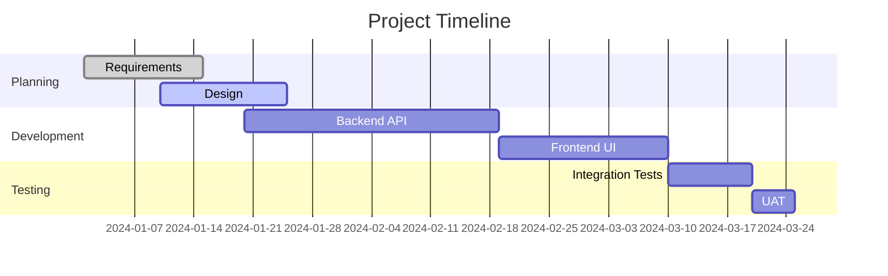

## Git Graph

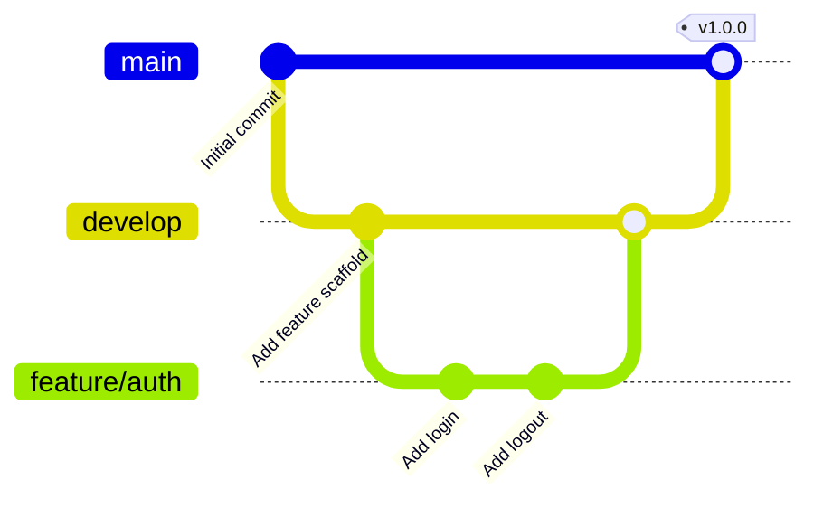

## Pie Chart

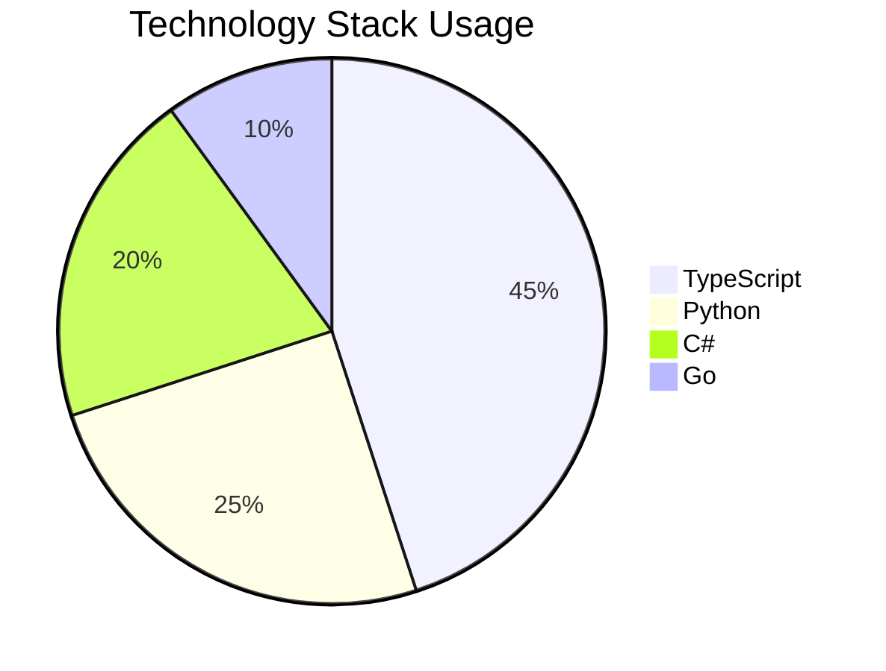

## User Journey

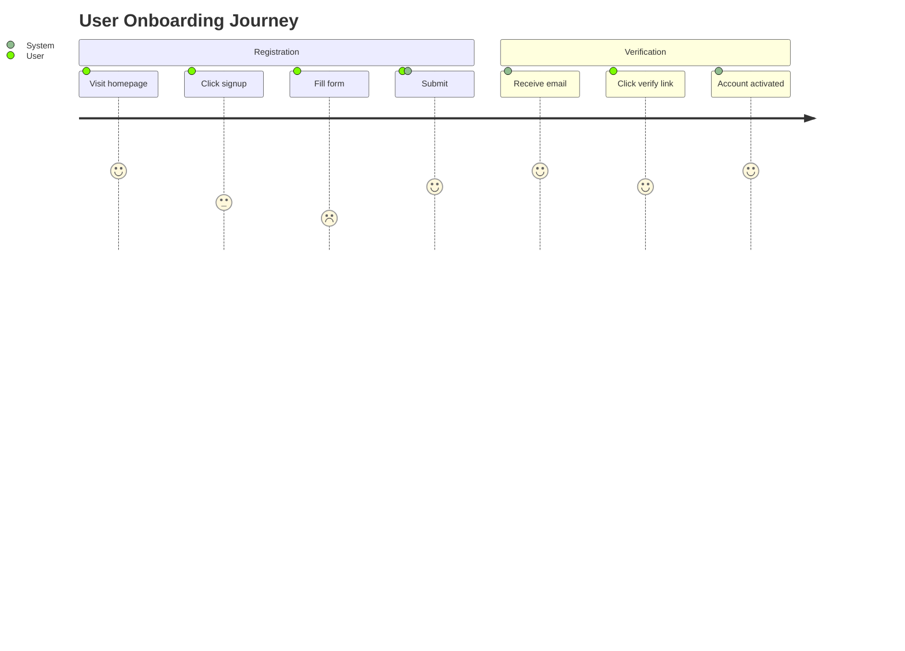

## Mindmap

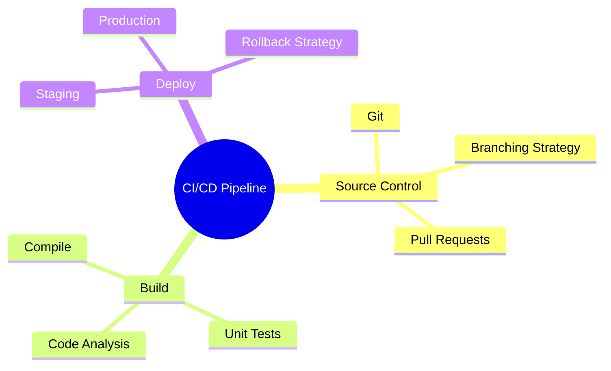

## Timeline

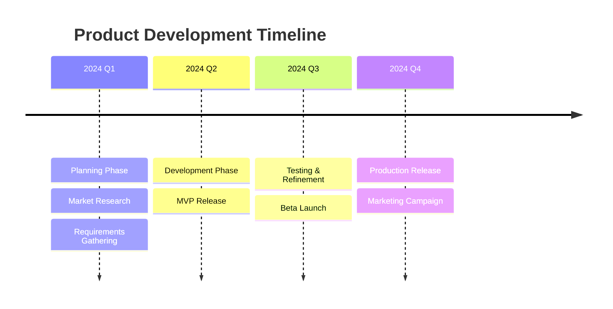

## C4 Context Diagram

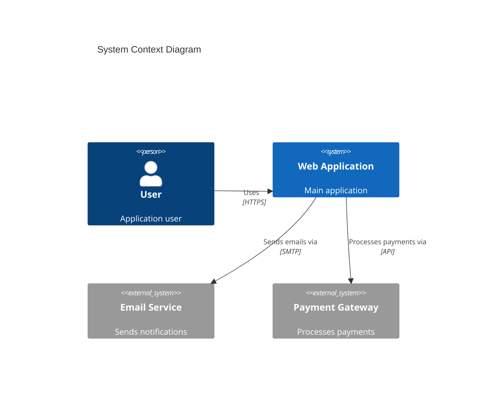

## C4 Container Diagram

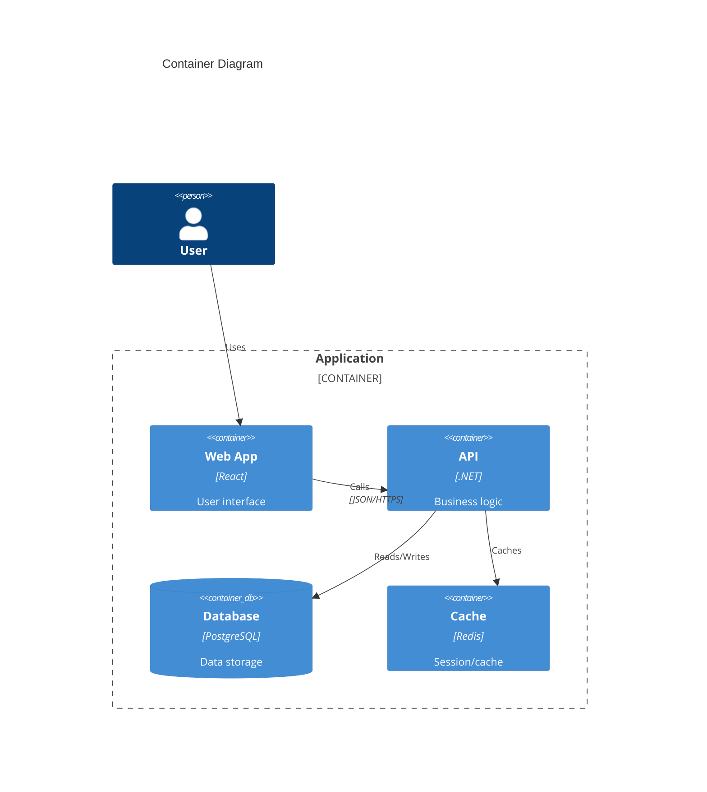

## Tips

1. **Escaping Special Characters:** Use quotes for labels with special chars: `A["Text with: special chars"]`
2. **Line Breaks:** Use ` ` for multi-line text
3. **Comments:** Use `%%` for comments in diagrams
4. **Subgraphs (Flowchart):** Group related nodes
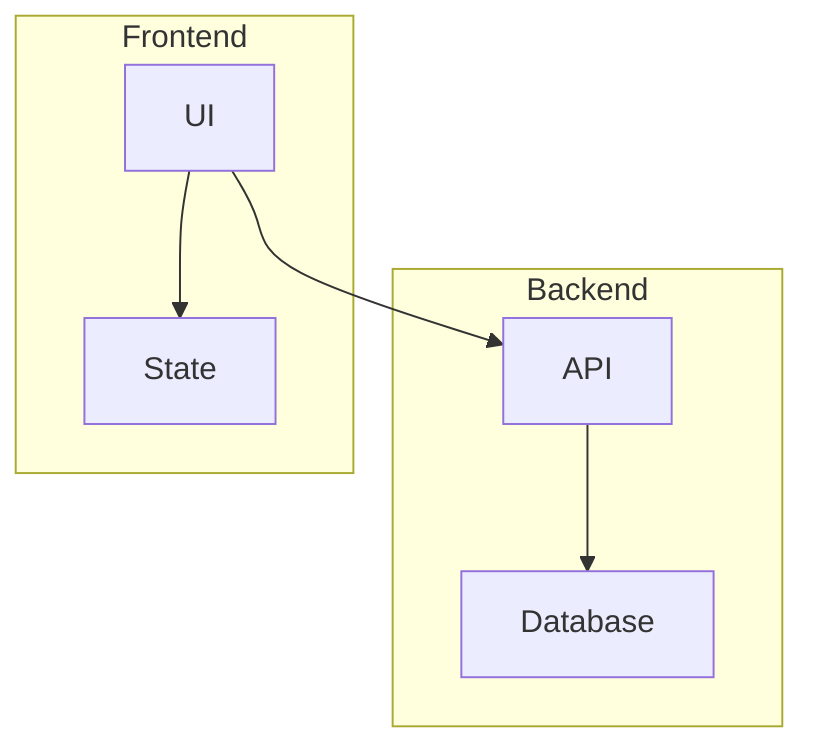
