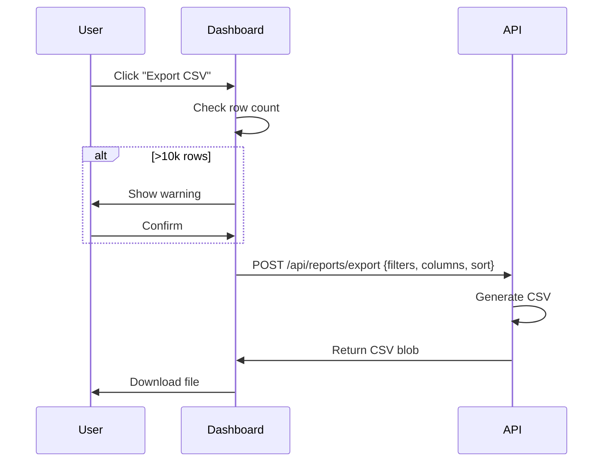

# Example Brainstorming Session

This shows the rhythm and style of an effective spec-writing session.

---

## Opening

**User:** I want to add export functionality to our reports dashboard

**Claude:** Export - interesting. Before I dig in, a few quick questions:

1. What would users export? The whole report, filtered data, or specific sections?
2. What format(s) are you thinking - PDF, CSV, Excel, something else?

Also, let me look at the current dashboard to understand what we're working with.

*[Researches: Glob for dashboard/reports files, reads key components]*

Found the reports dashboard - looks like it's a React app with `ReportsGrid.tsx` showing tabular data with filtering, and `ReportsSummary.tsx` showing charts. The data comes from `/api/reports` endpoint.

I'll start documenting. What are your thoughts on format and scope?

---

## Exploration

**User:** CSV for now, the filtered data they're looking at. Eventually PDF too but that's later.

**Claude:** Got it - CSV of the currently filtered view. That's well-scoped.

A few things I want to understand:
- Who's asking for this? Is it power users doing analysis, or everyone?
- What happens with large exports? If someone has 50,000 rows filtered, should we limit or handle differently?

*[Creates: @documents/spec-export/overview.md with initial Problem section]*

**User:** It's mainly our enterprise customers - they want to pull data into their own tools. Good point on size - probably should limit to 10k rows? Or maybe warn them?

**Claude:** Enterprise customers pulling into external tools - that's useful context. Suggests they might also want:
- Consistent column headers (for automation)
- Maybe a "download all pages" option eventually?

I'll park that as a future thought.

*[Creates task: "Explore: bulk/scheduled exports for enterprise"]*

On the size limit - 10k hard limit vs warning are different UX. Hard limit is simpler but might frustrate users. Warning lets them proceed but you need to handle the load. Which matters more - simplicity or flexibility?

**User:** Let's do warning at 10k, hard limit at 50k. We can always adjust.

**Claude:** Clear. Let me capture that.

*[Updates requirements.md with export limits]*

Now I want to challenge one assumption - you said "the filtered data they're looking at." Does that include:
- Just the visible columns, or all available columns?
- The current sort order?
- Any grouped/aggregated rows, or just raw data?

These affect implementation complexity quite a bit.

---

## Technical Exploration

**User:** Hmm, good questions. Visible columns only, yes keep sort order, and raw data - we don't have grouping yet anyway.

**Claude:** That simplifies things. The export is basically: "serialize what's on screen to CSV."

Technically, this could work two ways:

1. **Client-side**: JavaScript generates CSV from the current grid state. Simple, instant, but limited by browser memory for huge datasets.

2. **Server-side**: Button triggers API call with current filters, server generates CSV. More robust for large data, but you need to replicate filter logic server-side.

Given your 50k limit and enterprise use case, I'd lean toward server-side - more reliable and you can add things like scheduled exports later. But client-side would be faster to ship.

Thoughts?

*[Creates architecture-options.md with both approaches sketched]*

**User:** Server-side makes sense. We already have the filter logic in the API.

**Claude:** Perfect - that's the cleaner path then.

Let me sketch the flow:

*[Creates flow-diagram.md]*

Does this match your mental model?

---

## Clarification

**User:** Yeah, but what about the filename? And should we track who exported what?

**Claude:** Good catches - I hadn't asked about those.

**Filename:** Options range from simple (`report-export.csv`) to descriptive (`reports-2024-01-15-filtered-by-region.csv`). What feels right?

**Audit logging:** Is this a compliance need, or nice-to-have analytics? That affects where/how we log.

*[Creates task: "Decide: filename format"]*
*[Creates task: "Decide: audit logging requirements"]*

**User:** Filename should have the date at least. Logging is nice-to-have for now, we can add it later.

**Claude:** Noted - I'll spec the filename as `reports-YYYY-MM-DD.csv` and mark logging as out of scope for v1.

*[Updates overview.md: adds "Out of Scope" section with audit logging]*

Let me also add a sample of what the export would look like:

*[Creates sample-output.md with example CSV showing headers and a few rows]*

---

## Wrapping Up

**Claude:** Let me summarize where we are:

**Nailed down:**
- CSV export of filtered, sorted data
- Visible columns only
- Server-side generation via API
- Warning at 10k rows, hard limit at 50k
- Filename: `reports-YYYY-MM-DD.csv`

**Open questions:**
*[Checks TaskList]*
- None blocking - the "bulk export" idea is parked for future

**Out of scope (v1):**
- PDF export
- Audit logging
- Bulk/scheduled exports

The spec folder has:
- overview.md (hub)
- requirements.md (detailed reqs)
- technical-context.md (dashboard code research)
- architecture-options.md (client vs server comparison)
- flow-diagram.md (sequence diagram)
- sample-output.md (example CSV)

Anything missing before we call this ready for implementation?

---

## Key Patterns Demonstrated

1. **Research early** - looked at codebase before deep questions
2. **2-3 questions per turn** - not overwhelming
3. **Challenge assumptions** - "does filtered include columns? sort? grouping?"
4. **Park tangents as tasks** - bulk export noted but not derailing
5. **Technical options with tradeoffs** - client vs server, let user decide
6. **Diagrams when helpful** - sequence diagram clarified the flow
7. **Samples for concreteness** - example CSV grounds abstract requirements
8. **Clear wrap-up** - what's decided, what's open, what's out of scope
